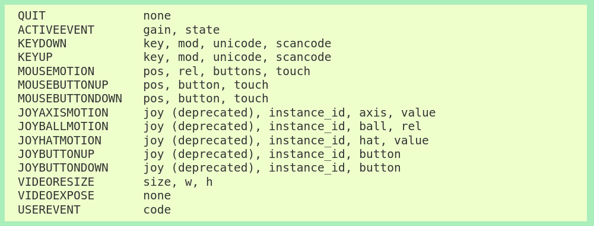

At this point we've learned about key game development ideas like *animation frames*, the *game loop*, and using *block transfer (blit)* to create the graphics for a frame. You also learned how to use variables along with the game loop in order to turn static images into dynamic animations.  Of course, we can't really call what we've made a game because it lacks *interaction*.

Perhaps the most fundamental form of interaction in games is giving the player the ability to control a character through keyboard, mouse, or controller inputs. We'll focus solely on keyboard input for our game.  In games, and many other interactive software systems, keyboard input is not handled through functions like python's `input` function. Instead they are handed through system *events*.  In order to let the player control their character, we need to understand how pygame represents events and how we can interact with them.


# Events, Event-Driven Programming, and PyGame

In *event-driven programming* your code does not determine the exact moment certain things happen but rather how to react, or *handle* key *events*.  For example, when you use the function `input`, you're causing a user input event to occur at that very moment. In an event-driven system, you don't initiate the event but you do write code to handle it.

Libraries like PyGame provide robust event detection and collection mechanisms so that programmers can focus predominately on the logic for handling the event.  In particular, the [event](https://www.pygame.org/docs/ref/event.html) module in pygame provides an event data type as well as functions for accessing the events detected and collected by the system. Let's start by understanding event data.

## Event Data and Basic Keyboard Events

Pygame supports a standard array of event types as seen in this table taken from the pygame event module documentation. The first column in the table lists the name of an event type. The second column lists the attributes of that type of event.



Let's take note of three event types: `QUIT`, `KEYUP`, and `KEYDOWN`. We've already encountered the `QUIT` event. It's the event that occurs when the user presses the X button to close the game window. It has no attributes. It is what it is. The other two events are what we get when someone uses the keyboard. We typically think of pressing a key as the singular act of pushing it down then releasing it. Both the down press and the release are their own distinct events. So long as a key is held down, the `KEYDOWN` event will occur. When the key is released, a `KEYUP` event occurs.

The attributes of both `KEYUP` and `KEYDOWN` events are the same. The first attribute, `key`, is the obvious one: which key on the keyboard was pressed or released. So, if `e` is a `KEYUP` or `KEYDOWN` event, then `e.key` tells you which key is down or up. The `mod` attribute allows you to detect modifiers like the shift, alt, and ctrl keys. The remaining attributes generally help you handle different kinds of keyboards. We shouldn't need them, but you can read more about them, and keyboard events generally, in the [key module documentation](https://www.pygame.org/docs/ref/key.html). One item of particular importance that you'll find in the key module  documentation is the complete list of possible values for the key attribute, i.e. the pygame names for all the keys on the keyboard.

It's helpful to recognize that both the type of an event and the different values for the key attribute are defined as named integer constants. We don't ever need to know, nor should we use as literals, the exact number for an event or key, but some of the ways that we'll use them make a lot more sense when you recognize that  expressions like `pygame.KEYUP` and `pygame.K_a` are just names assigned to a number. Now that we know a little bit about events, let's look at how we interact with and handle them in our code.


## Our First Encounter with Event Handling

You've already seen event handling code. Our game loops have the following block of code at the top. You were told it handled quitting the game when the user presses the X at the top right of  the window and then directed to ignore it. It's time to take a closer look. Let's see that code again, now with some annotations:

```Python
#  for each event that has occurred since the last frame :
for event in pygame.event.get():
        # if one is the QUIT event
        if event.type == QUIT:
            # then quit the game and exit the program entirely
            pygame.quit()
            sys.exit()
```

The first thing you see is a new kind of loop: `for event in pygame.event.get():`. The function call `pygame.event.get()` returns a collection of all the events in the *event queue*, where pygame stores events it has detected.  The `for` loop then assigns each event, one at a time, to the variable `event`. The code within the loop determines how an event should be handled. In this case, there is only one event we care about: the `QUIT` event. If the `event.type`, the type of the currently selected event, is `QUIT`, then the functions to quit pygame and close the program are called. Any other event in the queue will be ignored as it will not have a type equal to `QUIT` and no other code was provided within the bounds of the loop.

We'll take the event handling pattern started in the quit handling code and run with it. When there are multiple event types of interest in a program, then we can generalize the above as follows: *for each event in the queue, check and branch based on the type, then handle the specific event types appropriately**. For example, if we want to start handling keyboard events, then we would expand the conditional as follows:
```Python
#  go through each event that has occurred since the last frame
for event in pygame.event.get():
        # if one is the QUIT event
        if event.type == QUIT:
            # then quit the game and exit the program entirely
            pygame.quit()
            sys.exit()
        elif event.type == pygame.KEYUP:
           # code to handle keyup events
        elif event.type == pygame.KEYDOWN:
           # code to handle keydown events
```

With keyboard events, the conditional hits will keep on coming. Once you've detected a `KEYUP` or `KEYDOWN` event, you're likely to proceed immediately to a conditional to check which key was pressed or released using the boolean expressions like `event.key == pygame.K_a`, which checks if the *a* key was pressed or released. The resultant block of conditionals and *nested conditionals* allows you to determine which type of event pygame detected and move on to what to do about.  Our primary interest at this point is translating keyboard events into player movement.
