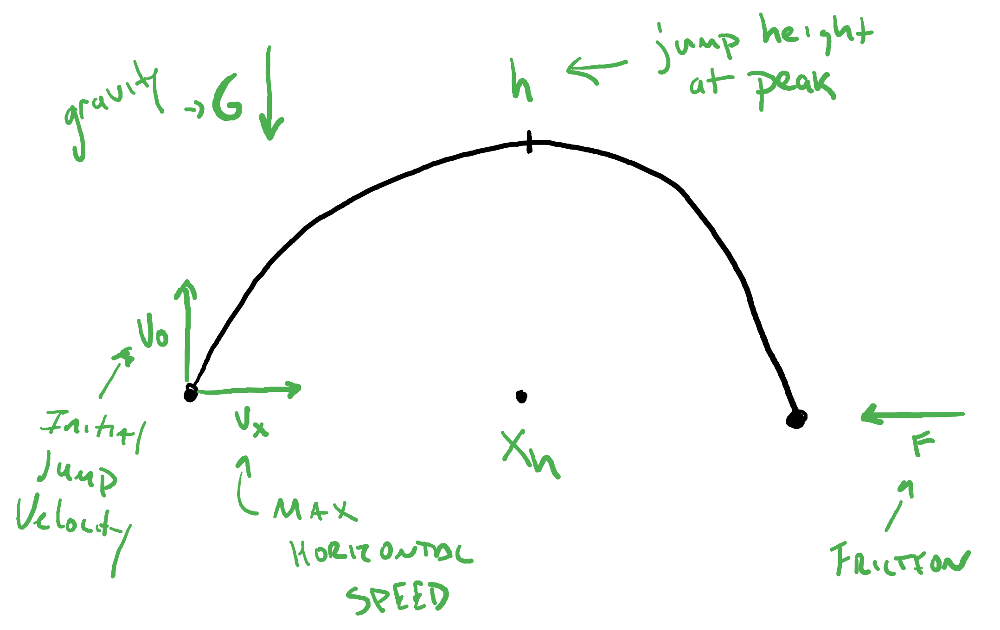

If you're interested in a side scrolling game with jumping. Then our simple velocity+position based movement model that we've worked with thus far won't quite cut it. For jumping to work we need some form of gravity to work against the upward force coming from the player.  In short, we need to base movement on the interplay between acceleration, velocity, and location, not just velocity and location.  

These notes are meant to be self-contained, but the jump design and mechanics presented below are largely based on this [excellent talk from Game Developers Conference 2016](https://www.youtube.com/watch?v=hG9SzQxaCm8).  Also, getting the math right for running with friction can be very tricky.  [This reddit post](https://www.reddit.com/r/gamedev/comments/bdbery/comment/ekxw9g4/?utm_source=share&utm_medium=web3x&utm_name=web3xcss&utm_term=1&utm_content=share_button) gets into some detail about it if you're interested. If you don't mind some references to calculus, or if you're looking for a reason why calculus and more advanced mathematics might help you as a programer, then I recommend you check these sources out. 

# Time

Before we get into the implementation of side scrolling movement and jumping, we need to talk about time. Up until now we've worked on fixed frame rates.  This mostly works when we're doing a simple animation, but once we combine animation and moving objects its really, really nice to separate the rate of player/object movement from the rate at which animation takes place. This property is often referred to as *framerate independence*.  For this to work we need to know how much real time has passed since the last frame update, or *tick*. Thankfully, pygame makes this pretty easy.

As we've seen already, the `time` module provides a `Clock` object for managing time in our games. We typically construct this clock prior to starting our game loop. In effect, *its a key piece of state for our game and it gets declared and initialized with all the other state variables.* You can construct a game clock as follows: 

```python
# construct the pygame clock object.
game_clk = pygame.time.Clock()
```

With a clock available, we can use the the `tick` method within the game loop to set the desired framerate, and it turns out that `tick` not only modifies the clock rate but returns the number of milliseconds that have passed since the last call to `tick`.  This is accomplished by passed the framerate as an argument and assigning the returned elapsed time to a variable. Below we use the variable `dt` to store time passed since the last tick. 

```python
# set frame rate to 30 fps, return time since last tick
dt = game_clk.tick(30) 
```

The variable to which we save the time elapsed since the last tick (`dt` above) is also an important pice of *game state*. It can be used to:
*  adjust animation and movement speed based on real-time passed rather than a frame-by-frame basis
*  keep a running total of time passed for games that use time in their mechanics (fixed time to complete a level, survive/play as long as possible, etc. )
*  Manage game play events (creation/spawning of enemies and obstacles) in real time

As an example, let's say we wanted our player animation to cycle through once every half second, or 500 ms. Given that our animation sequence has 3 images to it, that means holding one animation frame for 500/3 milliseconds before switching to the next one. To manage this we need to track not just time between ticks, but elapsed time. To do this we start a new state variable (outside of our `while` loop of course) with a value of 0. 

```python
# outside and before the game loop
et = 0 # elapsed time
```

We can then keep a running total of time by adding each new `dt` value to this variable. 

```python
#inside game loop. first or last thing
dt = game_clk.tick(30)
et += dt
```

If we're using the elapsed time variable `et` purely for our player animation, then we can simply condition the changes to animation state based off that value and reset the counter on every update:

```python
# When updating animation state (onTick code)
if et >= 500.0/3:
    #update player animation rectangle/state
    et = 0
```

Similar logic can be used to manage background animation on fixed, real-time intervals, i.e. take 2 seconds for one full rotation of the background. All of this is completely independent from the rate at which the game computes new frames. 


# Movement Design   

Movement in games is intensional. Players move about to interact with the environment and overcome the challenges that make the game a game.  This means we cannot be completely arbitrary with player movement or we risk presenting the player with impossible challenges: jumps they can't make, objects they're too slow to catch, etc.  

To keep things simple, we'll only consider very basic, fixed movement parameters. Games these days definitely paint outside these lines, but what's presented here is a good starting point from which you can get creative. As a game designer and programmer, you might initially decide on the answers to the follow questions: 

* What's the player's top speed when walking/running? 
* By how much does pressing a key accelerate the player? 
* How high can the player jump when moving at top speed?
* How far will they travel when they jump while moving at top speed?


From here we can figure out what other parameters are needed to achieve our design. 

## Movement Constants

The above questions lead to a series of constants from which we can derive other values needed to meet our movement design. You, the designer will choose values for these constants:  

```python
# max horizontal speed (pixels/sec or pixels/frame)
VX 

# acceleration increment (pixels/(sec^2) or pixels/(frame^2))
ACC 

# max jump height (at top speed) (pixels)
H 

# horizontal distance traveled reaching the peak of the jump. (pixels)
XH 
```

From these constants we can derive several other important movement constants. These values are carefully computed from the above programmer assigned values so that jumps reach the desired height over the desired distance and so that running reaches the desired top-speed given the increment of acceleration. 

```python
# Friction when running/walking 
F = VX / (VX + ACC)  

 #Gravity while in the air 
G = (2 * H * (VX**2)) / (XH**2) 

#Jump Acceleration (initial velocity)
V0 = (2 * H * VX) / XH  
```

We can get a sense of the role of all of these constants/forces from the following image:




Finally, in our simple game, we'll need to know the y-coordinate for the floor. This can be saved to a constant `FLOOR`. In general, there isn't one floor, but a collection of objects upon which the player can stand; that comes later. For now, we'll just keep it simple and say that when the bottom of the player rectangle is at `FLOOR` height, then they are on the ground and they can run and jump. Once they jump their location is no longer on the floor and they cannot run or jump; player-controlled movement while in the air is not being considered here. 

## Movement State

A side-scrolling player requires three pieces of state: **location**, **velocity**, and **acceleration**. Because motion is happening in two dimensions, each of these have an *x* and *y* component. In practice we'll use a `Rect` to manage the location x and y, but you might find that using floats which get converted to integers for the `Rect` yields some smoother results. Velocity and acceleration can either be two independent variables each, objects like `Vector2`, or even tuple or lists types (which we haven't discussed yet). For these notes we'll use the following names:

```python
x  # location x component
y  # location y component
dx # velocity x component
dy # velocity y component
ddx # acceleration x component
ddy # acceleration y component
```

## The Keyboard Affects Acceleration

The player moves their character by accelerating the character. That is to say, *pressing a movement key modifies the acceleration state variables `ddx` and `ddy`*. Actual changes in location will then occur as a side-effect of acceleration and happen during our time-based "tick" updates. For basic running and jumping movement, we set the acceleration values as follows: 

* *When on the floor*
    * Pressing left/right keys down sets `ddx` to `ACC`. Releasing them sets `ddx` to 0. 
    * Pressing up sets `ddy` to `-V0`

Once the player has left the floor, they can no longer accelerate. That said, if you want to explore things like double-jumps or speeding up and slowing down mid-jump, then allowing some kind of acceleration in the air is worth playing with. The video linked above also talks about having mid-air key presses temporarily affect gravity. In either case, what the player is doing is modifying accelerating forces, not velocity and not location. 

## Time-based Updates

With the player controlling acceleration, we can now use simplified physics to update velocity and location and get real-ish movement. The general pattern you'll see here is that acceleration modifies velocity which then causes a change location. All of these updates happen as a result of the passage of time; they are *tick* events. 


### Acceleration 

While acceleration is largely determine by keyboard events, there is one important time-based change that you need to account for:

* Acceleration (`ddx` and `ddy`) goes to zero if you're not on the floor. 

In a nutshell, unless you want to deviate from physics, you cannot accelerate yourself without pushing off of nothing.  Some of this can be managed by good floor checks when handling keyboard presses, but because players leave the floor as the result of time updates to velocity and position, you'll need to do a time-based check to see if acceleration should get zero'ed out when you're player is in the air.  

### Velocity 

Velocity is a product of acceleration from the player and deceleration from gravity and friction. We'll use different rules for calculating the current horizontal velocity (`ddx`) and vertical velocity (`ddy`). First, let's look at what happens on the ground. 

Friction, *which should always be a number between 0 and 1*, acts to dampen the natural additive accumulation of acceleration.
```python
dx = (dx + ddx)*F
```
With no friction (F=1), we'd increase velocity by the current acceleration and so long as the player is accelerating, they'll continue to get faster and faster unless you put a hard cap on horizontal velocity, `dx`.  On the other side of things, with maximal friction (F=0), the player never moves because acceleration never overcomes velocity. By calculating `F` based on our desired max velocity (`VX`) and increment of acceleration (`ACC`) we ensure that the acceleration and friction reach equilibrium when the player reaches the desired max speed.  No need to cap velocity! Friction takes care of it.  

While friction and acceleration work together to reach max velocity, we need to take steps to ensure that friction along will  eventually bring velocity to 0 and that the player will stop all motion. Our velocity update calculation does not guarantee that velocity will decay to exactly zero. It will  get really close, but not quite there. So, we need to include the following in our update for velocity: 

* When `dx` is very small (probably something like -1 < dx < 1), then set `dx` to 0 to stop the player. 

Now we turn our attention to the vertical world and updating `dy`.  Gravity works differently than friction. Specifically, it's added to velocity rather than multiplied with it.  We start with the basic update rule:

```python
dy = dy + (ddy + G)
```

Once again, we've calculated a value for G that will, when combined with the location update rules, ensure the kind parabolic jump that we want. We do need to be careful about the sign for `G` and `V0`.  If we interpret going up as moving in the negative direction, then `V0`, the initial acceleration/velocity of the jump is a negative value and `G` must therefore be positive in order to work against the player's upward acceleration.  

Like with horizontal velocity, we need to look out for a special case when updating `dy`. While real gravity is always acting on object, our game gravity should really only act upon objects in the air.  When our player is on the floor, then we imagine there is no gravity. So long as the player is not jumping, i.e. so long as their vertical acceleration is 0 and they are on the floor, then their vertical velocity should be zero. 

* When the player is on the ground not jumping (on the floor with no vertical acceleration) then `dy` should be 0 and stay zero. Gravity no longer has an effect. 

### Location 

We know how acceleration, friction, and gravity work to increase and decrease velocity. Now we can look at how velocity and acceleration work to update location.  Here we do not have to treat horizontal and vertical motion separately. The formula is the same and comes from physics and calculus.  

The equation to update location introduces a new variable, `dt`, which represents the amount of time that has passed.  If you don't want to worry about real-time and framerate independence, then ignore this term. In your program all updates are happening on a frame-by-frame basis; all your rates are on a per-frame scale. For example, a max velocity, `VX`, of 15 is 15 pixels per frame.  If,however, you want to work with framerate independent movement, then you specify constants on a per second basis and `dt` would be the number of seconds that have passed since the last update. With that out of the way, here's the location update formula:


```python
x = x + (dx + ddx/2)*dt
y = y + (dy + ddy/2)*dt
```


As was the case for acceleration and velocity, there are some special cases we need to watch out for when updating location.  

* If the player is at or past the "wall", then you'll want to adjust the location accordingly. Typically, this means a post-update adjustment to `x` to either wrap-around to the other side of the screen or to fix `x` to the wall. 
* The player might not exactly hit the floor when landing, so, if `y` (or `y` plus the height of the player) is past or perhaps very close to the floor, you should fix `y` to the floor to avoid visual and logic bugs.  