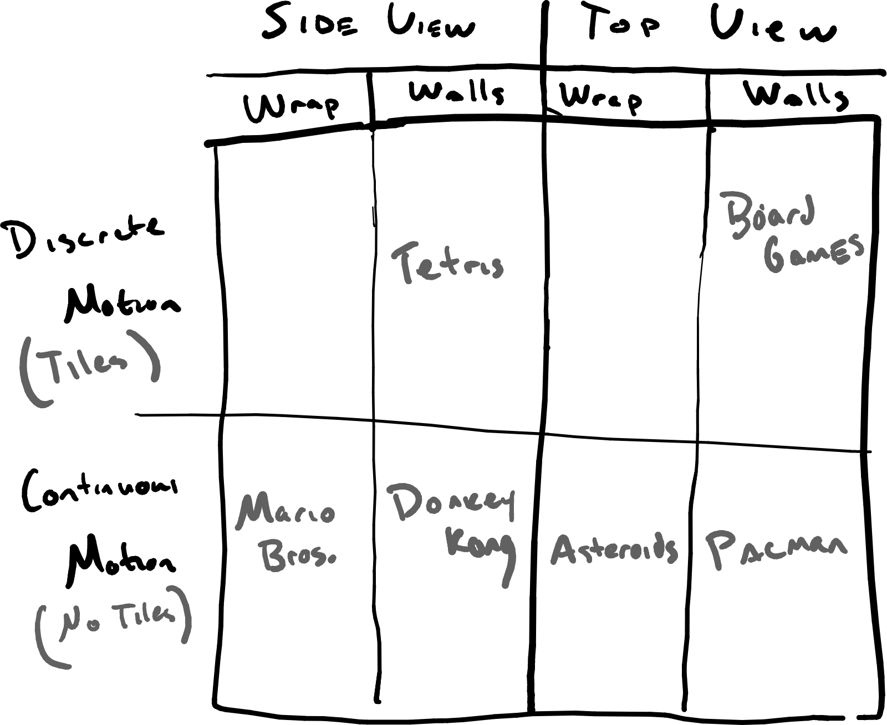

Before we get into the nuts and bolts of turning keyboard events into player movement, it's important to think about why we want players to move and how movement might fit into the overall goal of the game. After all, movement is a means to an end and different types of games require different types of player movement.  So, before we start making players move, we need a clear vision for why and how players will experience movement. That vision then becomes requirements for our program.

## A Design Space for Game Environments and Player Movement

Let's start by thinking about a restricted design space for classic 2D games. This gives us a box that we can then work within or perhaps think outside of. Our first simplifying assumption is that the entire play space is displayed on the screen.  No scrolling. What you see is what you get.  You can see examples of this kind of space in classics such as [Space Invaders](https://en.wikipedia.org/wiki/Space_Invaders), [Donkey Kong](https://en.wikipedia.org/wiki/Donkey_Kong), [Tetris](https://en.wikipedia.org/wiki/Tetris), [Asteriods](https://en.wikipedia.org/wiki/Asteroids_(video_game)), [Pac Man](https://en.wikipedia.org/wiki/List_of_Pac-Man_video_games), and the original [Mario Bros.](https://en.wikipedia.org/wiki/Mario_Bros.).

Once we've restricted the play space to the screen, we have two decisions to make: *how will the player see the space* and *what happens at the boundary of the space*. The player's view can be from the side or top-down. The boundary of the space can be walls or a boundary they cannot get past or it can wrap around where going off the right side of the screen brings you in from the left. Related to these decisions is how we imagine the player moving through the space. We can boil this down to roughly two choices as well:  discrete, grid-like movement and continuous movement.  The former means players move in fixed-size steps like they are on a board. The later movement describes a space in which the player can basically move where ever they want.

Putting all of this together we have three key design choices to work within (or maybe to throw away!):
  1. Player View: Side-view or top-down.
  2. Boundary Behavior:  Walls or wrap-around.
  3. Movement Type: Grid-like or Continuous.

All the aforementioned classic games can be fit into one of these design boxes:

Before launching into how to use python to implement player movement, take some time to decide what kind of game environment you want to work within.  That intension then guides your progress, narrows your focus in terms of what kind of programming you need to do, and ultimately tells you when your work is done. The goals and features of the game tell you what you need to accomplish with your code.
