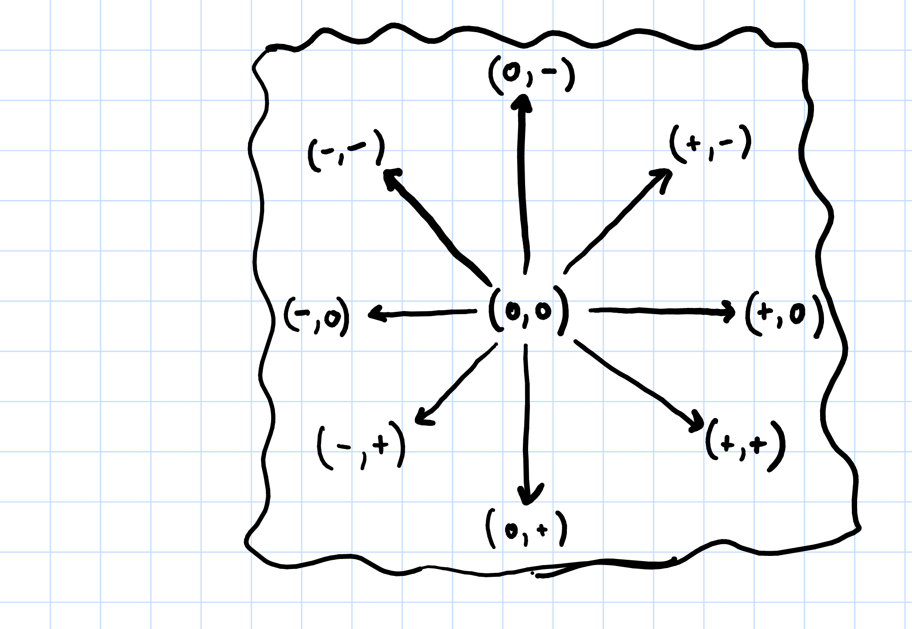

Once you understand the kind of movement required by your game, then it becomes a matter of meeting those requirements through your code. Lets start by reflecting back on what we learned through creating animations. We started out drawing a static, no-animation player character with statements like this:

```python
DS.blit(PC, (200,300),(200,150,50,70))
```

Assuming the display surface was named `DS` and the player animation sheet surfaced was named `PS`, statements like the one above transferred one image from the sheet onto the display. In this made-up example we're dealing with a 50x70 pixel character image located at (200,150) in `PC` that is transferred to (200,300) in `DS`.

To animate the character and make it seem like they were walking in one direction, we replaced they y-coordinate of the player image with a variable and cycled that variable through the y-coordinates of the images in a single column of our player sheet. This resulted in something like this:
```python
DS.blit(PC, (200,300),(200,y,50,70))
```
All the other values in our statement were fixed because nothing else about the player changed. They did not actually move and their animation sequence all drew from a single column on the sheet. Once we start moving the player, most of these values will start to vary from one frame to the next.

Let's think about all the things that might change about the player as they are moving and relate that to the arguments passed to the `blit` method.
  * If the player is moving in multiple directions, then we need images from different columns of our animation sheet, not just one column.  *This means the x-coordinate for the player image can vary from one frame to the next in addition to the y coordinate.*
  * If the location of the player is changing within the scene, then the transfer location is changing. *This means the x and y coordinates for the transfer location can vary from one frame to the next.*

To draw a player in motion, we'll need variables for nearly every one of the arguments to `blit`. Some variables will change over time like before, but some will change as the result of user interaction with the keyboard.  Once again, our task as a programmer boils down to managing and updating variables. The question is how to orchestrate all of these variable changes in order to achieve animated player motion.

# Your Player is not an image. It's a collection of Variables.

Before we get down to coding, we need to make a big shift in how we think about our game. It's natural to think about the player in terms of what the player sees. This means all these variables we seem to need are determined by the image we want to draw.  It's better to think the other way around, *the image the player sees is a visualization of a collection of variables we use to represent the player's current state*.  As far as our program is concerned, **the player is the collection variables**.

If we have a player in motion and we want to animate that motion, then we need variables to track their *location and direction*. On any given frame, we can determine which character image to draw based on those variables.  Is the player at the top of the screen moving left? Then transfer images from the left facing column to those locations as long as they are moving. Are they standing still? Then transfer the same standing still picture to that location or if you have art for an idle animation, transfer the images from that sequence. The key here is recognizing that player location and direction tell us which images to render. If we focus on managing the player variables properly, then the drawing part of the program will follow relatively easily.


#  Making Movement Happen

Implementing player movement means (1) deciding on a set of variables to represent the player, (2) determining how movement translates into updates to those variables, and (3) determine how to translate the variables into the arguments for `blit`.  Conceptually, we need to know the *location* and *direction* of our player. In practice, what we need to know about these attributes and how best to represent them in our program will depend on the style of movement we're trying to achieve.


## Simple Stepping - Player Controlled Location

The simplest form of movement we can implement is translating a keyboard press directly into a change in the location of the player. You'll find that this kind of movement doesn't leave space for much animation and requires the player to press and release the button for each step they wish to take. The advantage of this kind of movement is that its implementation is pretty straight forward. If your game takes place in a very grid like environment, then this might work for you. If nothing else, understanding this form of movement and its implementation is a good stepping stone to more robust forms of player movement.

It's not a stretch to say that pygame runs on rectangles. Our graphics workhorse, `blit`, is literally about copying one rectangular part of a rectangular surface onto another rectangular surface. When it comes time to deal with collisions, we'll once again turn to rectangles and give objects a *hitbox*, which effectively means they are just some rectangular space within the scene and anything that crosses into that space has collided with them. So, let's lean into this rectangular business and start representing our player as two Rectangles. One rectangle represents where they are within the screen space. The other represents which of their animation images currently represents them, i.e. what part of the animation sheet should be drawn next. *In simple stepping movement, the screen space rectangle represents their location and the animation sheet rectangle represents their direction.*

Pygame has a proper [rectangle data type](https://www.pygame.org/docs/ref/rect.html), the `Rect`. This datatype makes working with rectangles much easier and was actually working behind the scenes in our animations. When you specified the location of a transfer or the region to be transferred, pygame would convert that to a `Rect` in order to complete the block transfer. A `Rect` object has four now familiar attributes: x location, y location, width and height. If the variable `PC_H` and `PC_W` represent the height and width of the player image (and by extension the actual player) and `SCREEN_H` and `SCREEN_W` the height and width of the scene, then we can initialize a player that is standing still in the middle of the screen as follows:

```python
from pygame.rect import Rect

# Rectangle for the PC image on the animation sheet (aka PC)
pc_img_rect = Rect((0,0,PC_W,PC_H))
#  Rectangle for the player within the Scene (aka DS)
pc_rect = Rect((SCREEN_W/2 - PC_W/2, SCREEN_H/2 - PC_H/2 ,PC_W,PC_H))
```
The starting values of `pc_img_rect` specify the rectangle around the character animation that is standing still where the values for `pc_rect` represent a player sized region with its center in the middle of our screen.

To move the player we just need to modify these rectangles accordingly. If stepping to the left means moving 10 pixels to the left and switching to the left facing image, then we would adjust the x value of `pc_rect` by -10 because pixel coordinates go down as we move left to right and set the x value of `pc_rect_img` to `3*PC_W` because the left facing player image is in the last column. The `Rect` class has a method called `move_ip` that lets you modify the current x and y values by some amount. Alternatively, we can access the different attributes directly.

```python
# move pc_rect -10 in the x direction and 0 in the y
pc_rect.move_ip(-10,0)
# assign 3*PC_W to the x attribute of pc_img_rect
pc_img_rect.x = 3*PC_W

```

The `Rect` class has several other ways to access and modifying the location and size of a rect. I'll introduce them on an as needed basis, but feel free to check out the documentation.

One benefit of using `Rect` objects to represent our player is that all the arguments for `blit` are contained within the rectangles and pygame will happily extract them for us!  This makes drawing the player straight forward. Just pass to blit `pc_rect` for the location where the player is to be drawn and `pc_rect_img` for the rectangle on the animation sheet.
```python
DS.blit(PC,pc_rect,pc_img_rect)
```
That's it.

## Gliding and Sliding - Player Controlled Velocity

Simple stepping is limited because the `KEYDOWN` event only happens once, regardless of whether or not the player is holding down the key. This means the player has to release and press the button to take another step. If you want the player to keep taking steps so long as the key is down, then we'll need to do two things: (1) rethink the `KEYDOWN` as a direction change, not a location change, and (2) rethink how we're representing player direction. In short, we need to introduce the idea of player velocity to our program.

Before we get to the code, let's talk about velocity and movement. Velocity represents how far you will travel in a certain amount of time, i.e. miles per hour. For our purposes, we want to know how many pixels the player will move in one frame of the game, or *pixels/frame*. We can use velocity to represent direction by incorporating a sign. Pixel coordinates go up as we go right, so a positive velocity means moving right and a negative means moving left. To take care of the y coordinate we just add a second velocity variable. In this case positive means moving down the screen and negative means moving up.  So, with two numbers, the velocity in the x direction and the velocity in the y direction, we can represent and determine player direction based on the sign (positive, negative, or zero) of the velocity values as follows:



This all might seem like overkill, but there is a huge payoff. With simple steps, the player pressing the key directly modified their location. In a velocity-oriented system, the player is instead changing their velocity when pressing a movement key. This means that movement and animation variables change in the same way we did before, as part of frame-to-frame, loop-based variable updates. The flow of control within the game loop is now firmly a three step process:

1. *Handle Key Presses and Events* Player presses a key which causes the velocity to be set accordingly.
2. *Do time-based variable updates* During the time-based variable updates add velocity values to location to determine new location then use velocity sign (or lack of sign for 0) to update the animation variables.
3. *Draw the scene* Now that location and animation variables are updated, we draw.

This change to *player controlled velocity* opens two doors within our game design space:
1. *Moving as long as the key is held down* This kind of movement is typical of side-view games where players hold down the movement key to continue moving in the desired direction. On a `KEYDOWN` event, we give our player a non-zero velocity value. On `KEYUP`, we set their velocity back to zero.  This means that so long as they are holding down the key, they will continue to move. When they release the key, velocity returns to zero and they'll no longer move.
2. *Never ending movement* You can see this movement in Pac Man. Once the player presses left, they will continue to move left until they hit a wall or change direction. In this case we give velocity a non-zero value on `KEYDOWN`. Nothing changes on `KEYUP`. If you want strict up-down or left-right movement, then you can zero out the x velocity when up or down is pressed or zero the y when left or right movement keys are pressed. Either way, this kind of movement isn't possible without some kind of velocity component.

### Implementing a Velocity Based System

To make this system as smooth as possible we need to not only decouple direction from the image rectangle but also decouple location from the screen rectangle. This means we now have a purely numerical representation of location and direction as well as the rectangles related to the graphics. Thankfully, pygame provides a [2D vector](https://www.pygame.org/docs/ref/math.html#pygame.math.Vector2) data type called `Vector2` that is picture perfect for representing (x,y) location and (x,y) velocity. A `Vector2` object stores two floating point numbers with attribute names `x` and `y`.  To create our player that starts in the middle of the screen we now do the following:
```python
# Location and Direction as x,y pairs in floating point
# location is centered within the screen
pc_loc = Vector2((SCREEN_W/2 - PC_W/2, SCREEN_H/2 - PC_H/2))
# direction is not moving at all
pc_dir = Vector2((0, 0))
# Rectangle for the standing still pc image from the sheet
pc_img_rect = Rect((0,0,PC_W,PC_H))
# Rectangle for where the player is within the screen and how big they are.
pc_rect = Rect((pc_loc.x,pc_loc.y,PC_W,PC_H))
```
When we want to change the velocity of a player we can assign values directly to the appropriate attribute or we can use the `Vector2` type `update` method to set both x and y in a single statement.
```python
# Start moving right and up at 5 pixels per frame
pc_dir.x = 5
pc_dir.y = -5
# Alternative, set both at once.
pc_dir.update((5,-5))
```
To update the location, we need to add the x attribute of the location to the x of the direction and the y location to the y direction. We could do this attribute by attribute, but the `Vector2` type is designed to let you add vectors in exactly this way using the `+` operator! This makes updating our player location VERY easy; the `Vector2` data type does most of the work for us.
```python
# update the location based on current direction
pc_loc = pc_loc + pc_dir
# Alternative shorthand
pc_loc += pc_dir
```

Once we've updated the player location and direction, we need to update the pygame rectangles so that what we draw reflects any changes. This means three things specifically:
  1. Set the screen rectangle x and y coordinates to be the nearest integer equivalents to `pc_loc`.
  2. Change the x coordinate of the image rectangle according to the signs of the direction. Our character sheets have one column per direction and we can specify the column by its x coordinate. We don't have animations for diagonal movement, so you'll have to decide how to handle that.
  3. So long as the player is in motion, change the y coordinate of the image rectangle using the same modular arithmetic technique we used in our animation.

Once again, pygame has made it so that `Vector2` and `Rect` play nice together. This makes updating the screen rectangle very easy. Remember that the (x,y) coordinates for our rectangle are those of its top-left corner. It turns out that you can set that corner of a `Rect` directly. The `Rect` object will happily accept a `Vector2` as a value to be assigned to its x and y coordinates and it will take care of any necessary float to int conversion.
```python
# update the player screen rectangle
pc_rec.topleft = pc_loc

```

Updating the image rectangle is less straight forward because the (x,y) values are implied by the player's direction vector. To manage this you'll need some conditionals that check the signs (positive, negative, or zero) for your directional vector components and adjust your x and y coordinates of the image rectangle accordingly.
