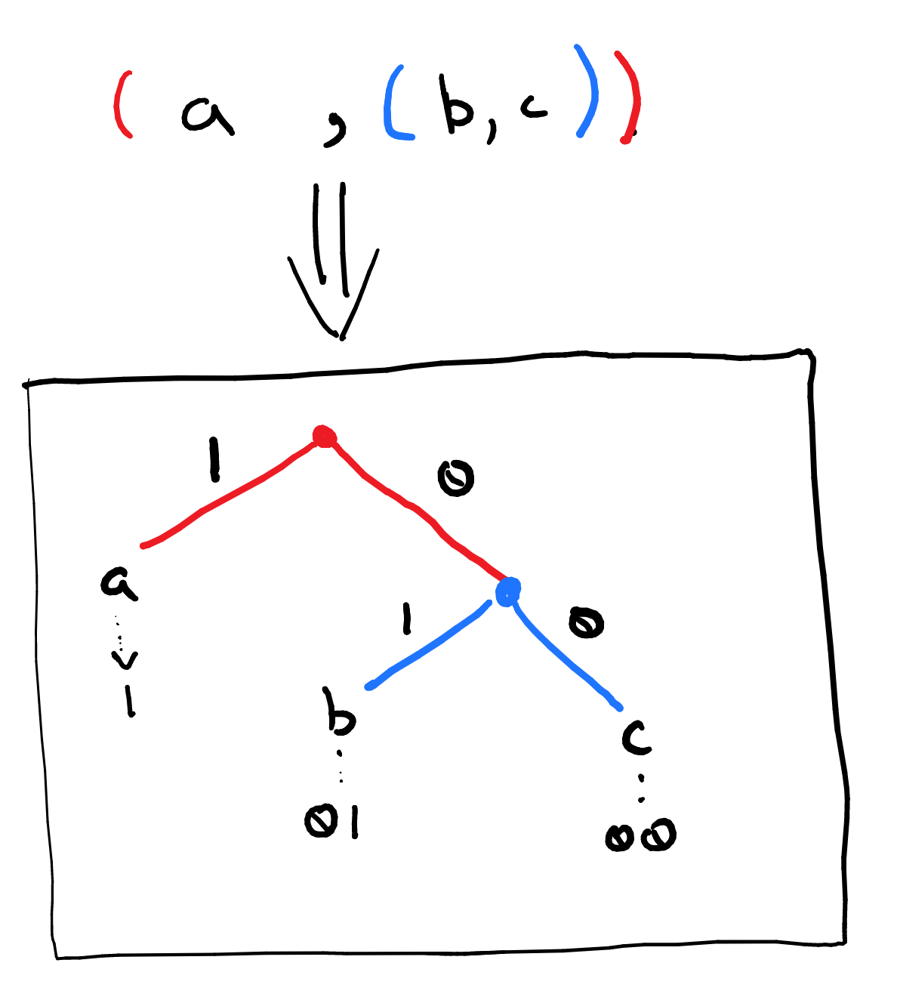

### Warm-Up - ASCII 

Let's get our data encoding brains warmed up by doing some straight forward ASCII encoding.  

1. Write your name in Hexadecimal using the [ASCII Encoding](https://www.asciitable.com/). 
2. Decode the following ASCII string: **44617461204D6F64656C732E**. (Hint: Remember, every two hex digits corresponds to a letter or symbol.)

### Huffman Coding - Toy Example

Now let's move on to generating a Huffman code for a specific message. Before we do something interesting, let's review a *toy problem*: something simple, but perhaps unrealistic, that let's us explore the problem and process without being too overwhelmed. 

Let's say we have the message *abbacaa*. The message has 7 total symbols comprised of three unique symbols *a*, *b*, and *c*.  First we need determine the relative frequency of each symbol.

| Symbol | Abs. Freq. | Rel. Freq |
| :--: | :--: | :--: |
|  a | 4 | 4/7 = .571 |
|  b | 2 | 2/7 = .285 |
|  c | 1 | 1/7 = .143 |

We can now construct out initial, frequency+symbol pairs. 
$$
\begin{array}{l}
\left(.571,a\right) \\
\left(.285,b\right) \\
\left(.143,c\right) 
\end{array}
$$

Next we start combining symbols into groups by choosing and removing from the collection the two least frequent items from the collection.  Here we combine *b* and *c* to form the group $\left(.428, \left(b,c\right)\right)$. The total frequency of this group is the sum of $b$ and $c$, i.e. $.428. The symbolic content of this grouping is a pair formed from $b$ and $c$ starting with the most frequent item of the pair. This new grouping is added back to the collection giving us the following:

$$
\begin{array}{l}
\left(.571,a\right) \\
\left(.428, \left(b,c\right)\right)
\end{array}
$$

We now continue with the exact same process: remove the two least frequent groups, combine, then add the new group to the collection. We only have two groups left in our collection, so these get combined into one final group. 

$$
\left(.999,\left(a,\left(b,c\right)\right)\right)
$$

Notice that we've kept the $\left(b,c\right)$ group together and nested it within the new group that includes $a$. This means that with the exception of the initial frequency+symbol pairs, *the groupings we create are **always pairs** and are comprised of symbols or other pairs*. 

With only one group left in the collection, we can now turn that singular grouping, $\left(a,\left(b,c\right)\right)$ into a code. This is most easily done by converting the nested pairs into a **binary tree** structure. Each pair corresponds to a *binary* branch and nesting corresponds to adding a new level to the tree.  For our toy example we get the tree shown below. The pairs and levels have been color coded. Notice that all the *paths* from the top of the tree to the bottom end at a symbol from our message. 

We extract the code by first labelling each left branch with a 1 and right branch with a 0. The code for a letter is the the sequence of 1s and 0s found on the path from the top of the tree to that letter as shown in the above image. We've arrived at the following code:

| Symbol | Code Sequence |
| :--: | :--: |
| a | 1 |
| b | 01 |
| c | 00 |

The message *abbacaa* is encoded as *1010110011*.  The tree also makes decoding straight forward.  Read the encoded message from left to right and follow the tree as you go until you reach a symbol.  That symbol will be the next symbol in your message. You then start over at the top of the tree.  For example, with *1010110011* we start with *1* and that means go left on the tree. There we find *a*, so that's our first letter. We're now looking at *0*, that means go right (from the top again). We're now at the blue dot and reading a *1*. This means go left on the tree which leads to *b*.  If we continue on in this fashion we'll decode the original message. 

### Huffman Coding - Your Turn

Time to get to the business. Consider the following message:

> data models are the abstractions used to describe problems

This message has 58 total symbols with 17 unique symbols. Let's carry out a Huffman coding process for this message. It's a long-ish message so we'll need to carefully manage the process lest we miss something. 

1. First we need to do a frequency analysis of the message. Begin by writing the 17 unique symbols on the left hand side of a piece of paper. Now count how many times each symbol appears in the message and record that next to the symbol. This gives you the *absolute frequency* of the symbol. We want the *relative frequency*, which is just the absolute frequency divided by the total number of symbols. (N.B. This tells you what percent of the total message is made up by a specific symbol.) To check your work, the sum of the absolute frequencies should be 58 (the total number of symbols) and the sum of the relative frequencies should be 1 (plus or minus some rounding).
2. We can now begin constructing the code. Start by writing out your 17 frequency+symbol pairs. Next, carry out the process described in the toy example and restated below. You'll need to repeat this 16 times (how do I know that?). Come up with some systematic way of tracking and recording this paper to ensure you don't get off track. Feel free to get creative in order to avoid re-writing repetitive groupings. Just don't get so creative that you introduce errors. 
        
    > Until only one grouping is left in the collection, select and remove the two least frequent groupings, combine them, and add them back to the collection. If, when selecting the next two groups, there is a tie in terms of frequency then select in least to greatest ASCII value order and prefer symbols over groups. 

3. Once you have the the final grouping, construct the tree and extract the code sequence for each letter. 
4. Now, re-write the original message using your code. **Compared to ASCII, what's the data compression ratio (original size divided by compressed size) achieved by our code?**
5. For more practice, using the same set of letters, write a *short* message and encode it with you code. Trade your message with your partner or another classmate and have them decode it (double check that you have the same trees).

#### What to Submit

Your submitted work should include the following:

1. Your work and solutions to the two ASCII warm-up problems. (problems 1 & 2 from the Warm-Up)
2. Problems 1-5 in *Huffman Coding - Your turn*.
    1. Your frequency analysis of the message. 
    2. Whatever you recorded during the code-construction process. 
    3. Your Huffman tree.
    4. The encoded message. 
    5. Your message (original and encoded) and your partner/class-mate's message (encoded and decoded.)